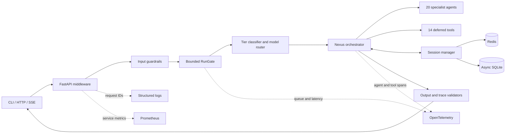

<div align="center">

# Cognexus

### Production infrastructure for coordinated AI systems

**A secure, observable, local-friendly multi-agent runtime built on the OpenAI Agents SDK.**

[](https://www.python.org/)
[](https://openai.github.io/openai-agents-python/)
[](https://fastapi.tiangolo.com/)
[](https://docs.pydantic.dev/)
[](#quality-gates)
[](#observability)

**Cognexus** is the product identity. **Nexus Runtime** remains the stable internal runtime, Python package, environment-variable namespace, and API implementation.

[Quick start](#quick-start) · [Architecture](#architecture) · [API](#http-api) · [Deployment](#deployment) · [Operations](#operations) · [Security](#security-model)

</div>

---

## What is Cognexus?

Cognexus is a production-oriented orchestration platform for systems that need more than a single general-purpose agent. It classifies each request, selects the appropriate reasoning tier, delegates bounded work to specialist agents or stateless tools, validates the result against architectural constraints, and returns a structured, traceable response.

It is designed for teams that need:

- **specialist coordination** instead of uncontrolled agent swarms;
- **persistent session memory** with Redis in production and async SQLite locally;
- **deterministic safety boundaries** around model input and output;
- **bounded execution** that behaves predictably on constrained machines;
- **operational visibility** without capturing prompts, outputs, secrets, or session content;
- **one runtime surface** for CLI, HTTP, SSE, Docker, CI, tests, and evaluations.

Cognexus currently ships with **20 specialist agents**, **14 executable deferred tools**, **39 progressively disclosed Agent Skills**, hierarchical routing, deterministic validation, and sequential tool execution with `parallel_tool_calls=False`.

> [!IMPORTANT]
> Cognexus is production-engineered infrastructure, not a substitute for application-specific authorization, human approval, domain compliance, or independent security review. High-impact actions should remain behind explicit application controls.

## Why Cognexus?

Most agent demos optimize for breadth. Cognexus optimizes for **control**.

| Concern | Cognexus approach |
|---|---|
| Routing | Hierarchical tier classification and explicit model selection |
| Delegation | Specialist agents and deferred stateless tools loaded from a canonical registry |
| Concurrency | Bounded global admission with local and cross-replica per-session ordering |
| Memory | Redis for production, SDK-native async SQLite for local development |
| Resilience | Explicit timeouts, bounded retries, observable fallback behavior |
| Safety | Input screening, output validation, trace validation, constraint enforcement |
| Streaming | SSE heartbeats with validated-output buffering before content release |
| Observability | Structured logs, OpenTelemetry spans, Prometheus metrics, request IDs |
| Secrets | Environment-only configuration and sensitive trace capture disabled |
| Quality | Ruff, strict MyPy, Pytest, coverage, dry-run smoke tests, package builds |

## Production status

**Current release:** `3.3.1`

The v3.3.1 release is a targeted completion and hardening release over the stabilized Nexus baseline. It preserves the existing routing model, session design, specialist registry, API contract, and `NEXUS_*` configuration namespace while improving performance, packaging, observability, and operational safety.

Validated release characteristics:

- canonical OpenAI Agents SDK imports under `agents`;
- local specialists isolated under `nexus_agents`, avoiding SDK namespace shadowing;
- shared `AsyncOpenAI` client with bounded transport retries and timeouts;
- bounded run admission and queue wait deadlines;
- same-session serialization across workers and Kubernetes replicas without globally blocking unrelated sessions;
- SDK-native `AsyncSQLiteSession` for local persistence;
- bounded Redis pool with explicit connection and socket timeouts;
- session-handle TTL/LRU eviction;
- cached agent definitions, tool definitions, and model-availability checks;
- safe SSE delivery that emits model text only after validation;
- six first-class execution modes: `focus`, `review`, `research`, `architect`, `brainstorm`, and `incident`;
- ambiguity-aware hybrid task classification with optional expert tier override;
- explainable, confidence-scored skill recommendations available through runtime and API contracts;
- additive response intelligence: assumptions, open questions, next actions, confidence, and session continuity;
- content-free telemetry for routing, modes, recommendations, queues, LLM calls, tools, sessions, and cache behavior;
- read-only, non-root, capability-free container execution;
- Python 3.11 through 3.14 package compatibility.

## Architecture



### Request lifecycle

1. FastAPI validates the request with Pydantic v2.
2. Security middleware attaches a request ID, applies trusted-host/CORS policy, and enforces rate limits.
3. Input guardrails reject malformed, unsafe, or obvious prompt-injection payloads.
4. `RunGate` admits the request within configured concurrency and queue deadlines.
5. The ambiguity-aware classifier selects a primary tier, hybrid supporting tiers, and the configured execution mode policy.
6. The recommendation engine proposes a minimal, confidence-scored skill set and the runtime selects a mode-bounded specialist subset.
7. Nexus delegates bounded work to registered specialist agents and tools.
8. The session layer loads history and computes a secret-redacted rolling summary, continuity score, and compaction signal.
9. Output, trace-block, and architectural-constraint validators inspect the result.
10. The API returns the original fields plus additive execution, confidence, recommendation, and session-intelligence metadata.

Detailed design notes are available in [`docs/ARCHITECTURE.md`](docs/ARCHITECTURE.md).

## Core capabilities

### Multi-agent orchestration

- Hierarchical routing across task tiers.
- Twenty unique specialist agents.
- Fourteen deferred, stateless tools.
- Registry-driven discovery and integrity checks.
- Configurable model routing without model names in business logic.
- Sequential delegation with `parallel_tool_calls=False`.
- Bounded turns and tool calls.

### Execution modes and intelligence

Every request may select one of six backward-compatible execution modes. Existing clients that omit the field continue to use `focus`.

| Mode | Runtime behavior |
|---|---|
| `focus` | Minimal specialist set and direct convergence |
| `review` | Independent correctness, security, and operations audit coverage |
| `research` | Evidence-first exploration with explicit uncertainty |
| `architect` | Boundary, invariant, trade-off, migration, and failure-mode analysis |
| `brainstorm` | Deliberate divergence followed by ranked convergence |
| `incident` | Impact, containment, reversible recovery, verification, and ownership |

The classifier detects hybrid intent, reports ambiguity and confidence, and accepts an optional `expert_tier_override` from trusted callers. Recommendations include the skill name, confidence, rationale, category, risk, and whether activation is suggested. Mode selection changes prompt behavior, preferred response structure, specialist budget, routing order, and recommendations without removing historical fields or interfaces.

### Sessions and memory

- **Redis:** recommended for production and multi-replica deployment.
- **Async SQLite:** zero-infrastructure local persistence and safe development fallback.
- **Stateless:** available only when explicitly enabled.
- Per-session execution ordering, including a bounded Redis lease across replicas.
- Bounded in-process session-handle cache.
- Configurable session TTL and Redis key prefix.
- Optional Responses API compaction.
- Safe session inspection that never returns message content.

The OpenAI Agents SDK provides native session memory and async SQLite/Redis implementations; Cognexus wraps those primitives with lifecycle control, fallback policy, diagnostics, and production bounds.

### Guardrails and validation

Cognexus applies deterministic checks before and after model execution:

- T1 input pre-screening;
- prompt-injection indicators;
- input and output size limits;
- secret-leak and unsafe-output checks;
- required NEXUS trace-block validation;
- architecture constraint validation;
- structured error responses;
- explicit degraded-mode warnings.

### Performance controls

The runtime is intentionally conservative for local systems, including machines with approximately 8 GB RAM:

- maximum concurrent runs;
- queue timeout;
- request timeout;
- transport retry limit;
- model retry limit;
- maximum turns;
- maximum delegated tool calls;
- Redis pool limit;
- session cache TTL and capacity;
- bounded SSE chunk size;
- no unbounded background fan-out.

## Technology stack

| Layer | Technology |
|---|---|
| Runtime | Python 3.11–3.14 |
| Agent framework | OpenAI Agents SDK 0.17.6 |
| OpenAI client | OpenAI Python 2.43.0 |
| Validation/settings | Pydantic v2 and Pydantic Settings |
| HTTP | FastAPI and Uvicorn |
| Local sessions | SDK-native `AsyncSQLiteSession` |
| Production sessions | SDK `RedisSession` |
| Rate limiting | SlowAPI |
| Logging | structlog |
| Tracing | OpenTelemetry and OpenAI Agents tracing |
| Metrics | Prometheus client |
| Testing | Pytest, pytest-asyncio, pytest-cov |
| Static quality | Ruff and strict MyPy |
| Packaging | setuptools, wheel, sdist |
| Deployment | Docker, Docker Compose, GitHub Actions |

## Repository layout

```text
.
├── config/              # Pydantic settings and canonical JSON registries
├── deploy/              # OpenTelemetry collector configuration
├── docs/                # Setup, architecture, security, operations, deployment
├── evals/               # Promptfoo configuration and evaluation cases
├── middleware/          # Compatibility-facing validation modules
├── nexus_agents/        # Local specialist agent definitions and registry
├── observability/       # Structured logging, traces, and Prometheus metrics
├── orchestrator/        # Routing, runtime bounds, conflict resolution, execution
├── scripts/             # Setup and deterministic smoke-test commands
├── security/            # Secrets, sanitization, policy, and rate-limit helpers
├── server/              # FastAPI app factory, schemas, dependencies, middleware
├── sessions/            # Redis, async SQLite, compaction, and lifecycle management
├── tests/               # Unit, API, session, registry, runtime, and telemetry tests
├── tools/               # Deferred tools, namespaces, handlers, and registry
├── tracing/             # OpenTelemetry bootstrap integration
└── validators/          # Trace and architectural-constraint validators
```

## Prerequisites

- Python `3.11`, `3.12`, `3.13`, or `3.14`.
- An OpenAI API key for live runs.
- Redis for the recommended production session backend.
- Docker Engine with Compose v2 for container deployment.

Dry runs and the unit test suite do **not** call OpenAI.

## Quick start

### 1. Clone and enter the repository

```bash
git clone <your-repository-url> cognexus
cd cognexus
```

Replace `<your-repository-url>` with the repository URL used by your organization.

### 2. Create a virtual environment

```bash
python -m venv .venv
source .venv/bin/activate
```

Windows PowerShell:

```powershell
python -m venv .venv
.venv\Scripts\Activate.ps1
```

### 3. Install dependencies

Recommended cross-platform bootstrap (Windows, Linux, macOS, or WSL2):

```bash
python scripts/bootstrap.py
```

The bootstrap checks Python compatibility and package-index DNS/HTTPS reachability before
invoking pip, applies the certified runtime constraints to developer installs, and supports
approved proxies, private indexes, and offline wheelhouses.

Manual development installation:

```bash
python -m pip install --upgrade "pip>=26,<27" -c constraints/runtime.txt
python -m pip install -r requirements-dev.txt -c constraints/runtime.txt
```

Runtime-only installation:

```bash
python -m pip install --upgrade "pip>=26,<27" -c constraints/runtime.txt
python -m pip install -r requirements.txt -c constraints/runtime.txt
```

When pip reports both a DNS/socket error and `from versions: none`, diagnose the network
rather than changing a valid dependency pin:

```bash
python scripts/bootstrap.py --diagnose-only
```

### 4. Configure the environment

```bash
cp .env.example .env
```

For live execution, set at minimum:

```dotenv
OPENAI_API_KEY=your-openai-api-key
NEXUS_API_KEY=generate-a-long-random-service-key
```

Generate a service API key locally:

```bash
python -c "import secrets; print(secrets.token_urlsafe(48))"
```

Never commit `.env` or real credentials.

### 5. Validate the installation

```bash
ruff check .
ruff format --check .
mypy .
pytest --cov --cov-report=term-missing
python scripts/test_nexus.py --dry-run
```

### 6. Start the API

Venv-aware local startup with preflight checks:

```bash
python scripts/start.py --env development
```

The startup wrapper prefers `.venv` when it exists, prepares local `.env`, `data/`,
`logs/`, and `artifacts/tmp/` state, verifies the runtime lock, runs the offline dry-run
smoke test, then starts the configuration-driven server. Use `--reload` for Uvicorn
auto-reload during local development.

Production-style launcher (honors the validated `NEXUS_HOST`, `NEXUS_PORT`,
`NEXUS_WORKERS`, proxy-trust, graceful-shutdown, concurrency, and backlog settings):

```bash
cognexus-server
```

Development with auto-reload:

```bash
python scripts/start.py --reload --host 127.0.0.1 --port 8000 --env development
```

Development interfaces:

- OpenAPI UI: `http://127.0.0.1:8000/docs`
- Alternative API docs: `http://127.0.0.1:8000/redoc`
- Liveness: `http://127.0.0.1:8000/health`
- Readiness: `http://127.0.0.1:8000/ready`

## Command-line usage

Dry-run execution:

```bash
python -m orchestrator.run \
  "Analyze this architecture and return a production checklist." \
  --session-id demo-session \
  --dry-run
```

Machine-readable JSON:

```bash
python -m orchestrator.run \
  "Review this deployment plan." \
  --session-id demo-session \
  --dry-run \
  --json
```

Logs are written to stderr so JSON on stdout remains machine-readable.

## HTTP API

### Authentication

Protected endpoints accept either:

```http
Authorization: Bearer <NEXUS_API_KEY>
```

or:

```http
X-API-Key: <NEXUS_API_KEY>
```

Authentication can be relaxed in local development according to the runtime settings. Production requires an API key.

### Endpoints

| Method | Path | Authentication | Purpose |
|---|---|---:|---|
| `GET` | `/health` | No | Process liveness; does not call external services |
| `GET` | `/ready` | No | Session, credential, model, and capacity readiness |
| `POST` | `/v1/run` | Yes | Execute one validated Cognexus run |
| `POST` | `/v1/run/stream` | Yes | Receive SSE progress and validated buffered output |
| `GET` | `/v1/skills` | Yes | List installed skill metadata |
| `POST` | `/v1/skills/recommend` | Yes | Return mode-aware, explainable skill recommendations |
| `GET` | `/v1/sessions/{session_id}` | Yes | Inspect safe session metadata and continuity signals |
| `GET` | `/v1/sessions/{session_id}/intelligence` | Yes | Return the rolling summary and context-optimization signal |
| `DELETE` | `/v1/sessions/{session_id}` | Yes | Delete persisted session history |
| `GET` | `/metrics` | Yes | Prometheus metrics |

### Run a dry request

Dry runs do not call OpenAI and are useful for deployment verification:

```bash
curl -sS -X POST http://127.0.0.1:8000/v1/run \
  -H "Content-Type: application/json" \
  -d '{
    "message": "Analyze this architecture.",
    "session_id": "demo-session",
    "dry_run": true,
    "execution_mode": "review",
    "expert_tier_override": 2
  }'
```

### Run a live request

```bash
curl -sS -X POST http://127.0.0.1:8000/v1/run \
  -H "Authorization: Bearer ${NEXUS_API_KEY}" \
  -H "Content-Type: application/json" \
  -d '{
    "message": "Analyze this architecture and propose the safest improvements.",
    "session_id": "demo-session",
    "execution_mode": "architect"
  }'
```

Representative response shape:

```json
{
  "run_id": "run_...",
  "session_id": "demo-session",
  "response_text": "...",
  "tier": 2,
  "tier_name": "...",
  "app_context": "...",
  "execution_mode": "architect",
  "classification_confidence": 0.91,
  "classification_ambiguity": "low",
  "supporting_tiers": [1, 2],
  "model": "configured-model",
  "trace_id": "...",
  "trace_validation": {},
  "constraint_violations": [],
  "token_usage": {
    "input_tokens": 0,
    "output_tokens": 0,
    "total_tokens": 0
  },
  "session_backend": "sqlite",
  "degraded": false,
  "warnings": [],
  "next_actions": ["Run the deployment gate."],
  "assumptions": ["Redis is available."],
  "open_questions": [],
  "confidence": 0.93,
  "recommended_skills": [],
  "session_intelligence": {
    "rolling_summary": "user: ... | assistant: ...",
    "continuity_score": 0.82,
    "compaction_recommended": false,
    "context_optimization": "rolling_window_healthy"
  },
  "queue_wait_ms": 0.0,
  "duration_ms": 0.0
}
```


### Recommend skills without running a model

```bash
curl -sS -X POST http://127.0.0.1:8000/v1/skills/recommend \
  -H "X-API-Key: ${NEXUS_API_KEY}" \
  -H "Content-Type: application/json" \
  -d '{
    "message": "Review API compatibility and release safety",
    "execution_mode": "review"
  }'
```

This endpoint is deterministic and does not call OpenAI.

### Stream a request with SSE

```bash
curl -N -X POST http://127.0.0.1:8000/v1/run/stream \
  -H "Authorization: Bearer ${NEXUS_API_KEY}" \
  -H "Content-Type: application/json" \
  -d '{
    "message": "Return a production-readiness checklist.",
    "session_id": "demo-session"
  }'
```

The stream emits:

1. `accepted` — request accepted;
2. `heartbeat` — execution is still active;
3. `metadata` — run, session, and trace identifiers;
4. `delta` — chunks of the fully validated response;
5. `done` — complete structured result.

Cognexus deliberately buffers model output until validation completes. The endpoint provides transport streaming and progress visibility, not unvalidated token passthrough.

### Inspect a session

```bash
curl -sS http://127.0.0.1:8000/v1/sessions/demo-session \
  -H "X-API-Key: ${NEXUS_API_KEY}"
```

The response exposes backend, item counts, a bounded secret-redacted rolling summary, continuity score, and compaction recommendation, but never raw message history. The dedicated `/intelligence` route returns the same intelligence object directly.

### Delete a session

```bash
curl -i -X DELETE http://127.0.0.1:8000/v1/sessions/demo-session \
  -H "X-API-Key: ${NEXUS_API_KEY}"
```

## Configuration

All runtime configuration is environment-driven and validated through Pydantic Settings v2.

### Core runtime

| Variable | Default | Description |
|---|---:|---|
| `NEXUS_ENV` | `development` | `development`, `test`, `staging`, or `production` behavior |
| `NEXUS_LOG_LEVEL` | `INFO` | Structured logging level |
| `NEXUS_HOST` | `127.0.0.1` | Bind host; containers override this to `0.0.0.0` |
| `NEXUS_PORT` | `8000` | Bind port |
| `NEXUS_WORKERS` | `1` | Uvicorn worker count; production values above 1 require Redis sessions |
| `NEXUS_FORWARDED_ALLOW_IPS` | `127.0.0.1` | Comma-separated proxy IP/CIDR trust list; `*` is rejected in live environments |
| `NEXUS_GRACEFUL_SHUTDOWN_SECONDS` | `30` | Graceful worker shutdown ceiling |
| `NEXUS_HTTP_CONCURRENCY_LIMIT` | `100` | Uvicorn in-flight connection/task bound |
| `NEXUS_HTTP_BACKLOG` | `256` | Socket accept backlog |

### Models and execution bounds

| Variable | Default | Description |
|---|---:|---|
| `OPENAI_API_KEY` | empty | Required for live model execution |
| `NEXUS_ORCHESTRATOR_MODEL` | configured in `.env.example` | Primary orchestration model |
| `NEXUS_SPECIALIST_MODEL` | configured in `.env.example` | Specialist-agent model |
| `NEXUS_GUARDRAIL_MODEL` | configured in `.env.example` | Model used where model-assisted guardrails apply |
| `NEXUS_COMPACTION_MODEL` | configured in `.env.example` | Session compaction model |
| `NEXUS_MODEL_VALIDATION_MODE` | `warn` | Model validation policy |
| `NEXUS_MODEL_VALIDATION_TTL_SECONDS` | `300` | Successful model-catalog cache TTL |
| `NEXUS_MODEL_VALIDATION_ERROR_TTL_SECONDS` | `30` | Provider-error cache TTL |
| `NEXUS_MODEL_VALIDATION_MAX_PAGES` | `20` | Maximum model-catalog pages per validation |
| `NEXUS_OPENAI_TIMEOUT_SECONDS` | `120` | OpenAI transport timeout |
| `NEXUS_OPENAI_TRANSPORT_RETRIES` | `1` | SDK transport retries |
| `NEXUS_MODEL_RETRIES` | `1` | Explicit model retry budget |
| `NEXUS_MAX_CONCURRENT_RUNS` | `2` | Process-wide concurrent run limit |
| `NEXUS_QUEUE_TIMEOUT_SECONDS` | `30` | Maximum admission queue wait |
| `MAX_TURNS` | `12` | Maximum orchestration turns |
| `MAX_TOOL_CALLS_PER_TIER` | `5` | Delegation bound per tier |

Model IDs remain configuration values rather than business-logic constants. Confirm that configured models are available to the target OpenAI project before production rollout.

### Sessions

| Variable | Default | Description |
|---|---:|---|
| `NEXUS_SESSION_BACKEND` | `sqlite` | `redis`, `sqlite`, or explicitly enabled `stateless` |
| `NEXUS_ALLOW_SQLITE_FALLBACK` | `true` | Allow Redis-to-SQLite fallback |
| `NEXUS_ALLOW_STATELESS_FALLBACK` | `false` | Allow stateless degradation |
| `NEXUS_SQLITE_PATH` | `./data/nexus_sessions.db` | SQLite database path |
| `REDIS_URL` | `redis://redis:6379/0` | Redis connection URL |
| `NEXUS_REDIS_MAX_CONNECTIONS` | `16` | Redis pool ceiling |
| `NEXUS_REDIS_TTL_SECONDS` | `604800` | Session retention |
| `NEXUS_SESSION_CACHE_MAX_ENTRIES` | `128` | In-process session-handle cache limit |
| `NEXUS_SESSION_CACHE_TTL_SECONDS` | `900` | Session-handle cache TTL |
| `NEXUS_COMPACTION_ENABLED` | `true` | Enable Responses compaction wrapper |
| `NEXUS_COMPACTION_CANDIDATE_ITEMS` | `10` | Item count that triggers the compaction recommendation |
| `NEXUS_SESSION_SUMMARY_MAX_CHARS` | `1200` | Maximum secret-redacted rolling-summary length |
| `NEXUS_SESSION_SUMMARY_ITEM_LIMIT` | `24` | Maximum recent items considered for session intelligence |

Production Redis mode requires `NEXUS_ALLOW_SQLITE_FALLBACK=false`; this prevents replicas from diverging into node-local session state during a Redis outage.

### API and security

| Variable | Default | Description |
|---|---:|---|
| `NEXUS_API_KEY` | empty | Service authentication key; protected routes fail closed in staging and production when absent |
| `NEXUS_RATE_LIMIT` | `30/minute` | Per-client request limit |
| `NEXUS_RATE_LIMIT_STORAGE_URI` | auto | Optional `memory://`, `redis://`, or `rediss://`; live Redis deployments automatically reuse `REDIS_URL` |
| `NEXUS_MAX_INPUT_CHARS` | `50000` | Normalized input character ceiling |
| `NEXUS_MAX_REQUEST_BYTES` | `262144` | Streaming request-body byte ceiling before JSON buffering |
| `NEXUS_MAX_OUTPUT_CHARS` | `200000` | Output size ceiling |
| `NEXUS_REQUEST_TIMEOUT_SECONDS` | `180` | End-to-end request deadline |
| `NEXUS_CORS_ORIGINS` | local origins | Comma-separated allowed origins |
| `NEXUS_TRUSTED_HOSTS` | local hosts | Trusted host allowlist |
| `NEXUS_ENABLE_DOCS` | `true` | Enable API documentation routes |

### Observability

| Variable | Default | Description |
|---|---:|---|
| `NEXUS_OTEL_ENABLED` | `true` | Enable OpenTelemetry instrumentation |
| `NEXUS_OTEL_CONSOLE` | `false` | Console span export for local debugging |
| `NEXUS_OTEL_SAMPLE_RATIO` | `0.25` | Trace sampling ratio |
| `OTEL_SERVICE_NAME` | `nexus-openai` | Telemetry service identity |
| `OTEL_EXPORTER_OTLP_ENDPOINT` | empty | External OTLP collector endpoint |
| `TRACE_INCLUDE_SENSITIVE` | `false` | Must remain false |
| `OPENAI_AGENTS_TRACE_INCLUDE_SENSITIVE_DATA` | `false` | Must remain false |

See [`.env.example`](.env.example) for the complete canonical configuration.

## Docker

### Start Cognexus and Redis

```bash
cp .env.example .env
# Add OPENAI_API_KEY and a strong NEXUS_API_KEY for live production-like runs.
docker compose up --build
```

Verify the services:

```bash
curl -fsS http://localhost:8000/health
curl -fsS http://localhost:8000/ready
docker compose ps
docker compose logs --tail=200 nexus
```

### Enable the optional OpenTelemetry collector

```bash
docker compose --profile observability up --build
```

### Container security profile

The application container runs with:

- a non-root UID;
- a read-only root filesystem;
- all Linux capabilities dropped;
- `no-new-privileges` enabled;
- a bounded temporary filesystem;
- explicit CPU and memory ceilings;
- a persistent data volume only for session storage;
- Redis isolated on an internal network.

The default Compose profile is suitable for local validation and a single-host deployment baseline. Review [`docs/DEPLOYMENT.md`](docs/DEPLOYMENT.md) before exposing it publicly.

## Deployment

Recommended production topology:

```text
Internet
   │
TLS ingress / reverse proxy
   │
Cognexus API replicas
   │
Private Redis
   │
OTLP collector / metrics backend
```

Production requirements:

- terminate TLS before the application;
- store secrets in a managed secret store;
- use Redis on a private network with authentication/TLS and a no-eviction policy;
- use shared Redis-backed rate limits for replicated deployments;
- set exact CORS origins, trusted hosts, and trusted proxy source CIDRs;
- keep stateless fallback disabled;
- disable SQLite fallback for ordinary multi-replica deployments;
- use immutable image tags or digests;
- configure liveness with `/health` and readiness with `/ready`;
- protect `/metrics` with the service API key and network policy;
- keep sensitive trace capture disabled;
- define rollback and session-retention procedures.

Deployment guidance: [`docs/DEPLOYMENT.md`](docs/DEPLOYMENT.md)

## Observability

Cognexus emits high-value, low-cardinality operational signals.

### Structured logs

Logs include request/run context where available:

- request ID;
- trace ID;
- run ID;
- selected tier;
- session backend;
- degraded state;
- latency and queue wait;
- error category.

Prompts, outputs, session messages, API keys, and authorization values must not be logged.

### Traces

OpenTelemetry spans cover:

- request admission and queue wait;
- routing decisions;
- prompt-cache outcomes;
- agent execution;
- LLM calls;
- delegated tool calls;
- session fallback;
- validation failures.

The OpenAI Agents SDK also supports tracing for generations, tools, handoffs, and guardrails. Cognexus configures its run path so sensitive inputs and outputs are excluded from trace data.

### Metrics

Prometheus metrics are available at `/metrics` behind authentication and include bounded labels for:

- request count and latency;
- active and queued runs;
- routing outcomes;
- tool execution count and latency;
- guardrail rejection count;
- session backend and fallback behavior;
- error classes.

Operational procedures: [`docs/OPERATIONS.md`](docs/OPERATIONS.md)

## Security model

Cognexus follows a defense-in-depth baseline:

- secrets loaded from environment variables only;
- no hardcoded credentials;
- constant-time API-key comparison;
- trusted-host and CORS allowlists;
- request rate limiting;
- strict Pydantic request schemas with unknown fields rejected;
- session ID format and length constraints;
- input sanitization and prompt-injection indicators;
- output secret-leak checks;
- response and request size bounds;
- authenticated metrics and session endpoints;
- non-root, read-only container execution;
- sensitive telemetry disabled.

Before public production use, add application-specific identity, authorization, network policy, key rotation, dependency monitoring, data-retention policy, and human approval for consequential actions.

Security guide: [`docs/SECURITY.md`](docs/SECURITY.md)

## Quality gates

Run the complete local release gate:

```bash
python scripts/quality_gate.py
```

The full gate is release-complete: after static checks, tests, repository validation, skill
validation, and dry-run orchestration, it builds distributions, verifies the wheel/source
archive, packages portable skills, generates the runtime SBOM, verifies runtime-lock/SBOM
parity, emits deterministic checksums, writes the release manifest, and runs final release
verification.

The equivalent manual sequence is:

```bash
ruff check .
ruff format --check .
mypy .
pytest --cov --cov-report=term-missing
python scripts/verify_version.py
python scripts/test_nexus.py --dry-run
python -m pip check
rm -rf build dist
python scripts/build_distribution.py --no-isolation
python scripts/verify_distribution.py
python scripts/verify_deployment.py
python -m venv /tmp/cognexus-runtime-sbom
/tmp/cognexus-runtime-sbom/bin/python -m pip install -r requirements.txt -c constraints/runtime.txt
/tmp/cognexus-runtime-sbom/bin/python -m skill_runtime.cli package --output dist/skills
/tmp/cognexus-runtime-sbom/bin/python scripts/generate_sbom.py --output dist/cognexus-runtime.cdx.json
python scripts/verify_runtime_lock.py --sbom dist/cognexus-runtime.cdx.json --require-sbom
python scripts/create_checksums.py
python scripts/create_release_manifest.py
python scripts/verify_release.py --dist dist --sbom dist/cognexus-runtime.cdx.json --require-sbom
```

The release workflow generates a source SPDX JSON SBOM and a deterministic runtime CycloneDX 1.6 SBOM, verifies checksums and the release manifest, signs build provenance and both SBOM attestations, and uploads the complete immutable artifact set. The security workflow builds and scans the runtime image for high and critical vulnerabilities. The deployment-verification workflow can run static checks alone or probe `/health`, `/ready`, and the authenticated recommendation endpoint against a deployed environment.

Run the online dependency audit:

```bash
pip-audit -r constraints/runtime.txt
```

`constraints/runtime.txt` contains exact pins for the active runtime graph. Platform-specific entries use PEP 508 markers so Linux release SBOM parity and Windows audit environments can both verify their active dependency closures deterministically.

The CI workflows validate supported Python versions, static typing, formatting, linting, tests, branch-aware coverage, dry-run orchestration, package builds, dependency health, and container builds.

## Evaluations

Promptfoo cases cover orchestration, routing, and safety behavior.

```bash
npx promptfoo@latest eval -c evals/promptfoo.yaml
npx promptfoo@latest view
```

Evaluation guidance: [`docs/EVALS.md`](docs/EVALS.md)

## Extending Cognexus

### Add a specialist agent

1. Define the specialist in `nexus_agents/specialists.py`.
2. Register it in `nexus_agents/registry.py`.
3. Add its canonical record to `config/agent_registry.json`.
4. Assign supported tiers and a clear responsibility boundary.
5. Add registry and routing tests.
6. Run all quality gates.

### Add a deferred tool

1. Implement a stateless handler in `tools/_handlers.py` or the appropriate module.
2. Expose it through `tools/namespaces.py`.
3. Register it in `tools/registry.py`.
4. Record it in `config/agent_registry.json`.
5. Keep inputs and outputs typed and JSON-safe.
6. Add unit tests and telemetry assertions.

### Change a model

Update `.env` rather than business logic:

```dotenv
NEXUS_ORCHESTRATOR_MODEL=<available-model-id>
NEXUS_SPECIALIST_MODEL=<available-model-id>
NEXUS_GUARDRAIL_MODEL=<available-model-id>
NEXUS_COMPACTION_MODEL=<available-model-id>
```

Use strict model validation in controlled production environments after confirming access for the target OpenAI project.

## Troubleshooting

### `/ready` returns `503`

Check the response details and verify:

- `OPENAI_API_KEY` is configured in production;
- Redis is reachable when selected;
- configured model IDs are available;
- strict model validation has completed successfully;
- the session backend reports ready.

```bash
curl -sS http://127.0.0.1:8000/ready | python -m json.tool
```

### Redis is unavailable

For local development, enable SQLite fallback:

```dotenv
NEXUS_SESSION_BACKEND=redis
NEXUS_ALLOW_SQLITE_FALLBACK=true
NEXUS_SQLITE_PATH=./data/nexus_sessions.db
```

For production, treat Redis failure as an operational event. Do not rely on node-local SQLite fallback in a multi-replica deployment unless that degraded behavior is explicitly accepted.

### Live requests return `401`

Set `NEXUS_API_KEY` and send either `Authorization: Bearer ...` or `X-API-Key: ...`.

### Live requests fail while dry runs pass

Verify:

- `OPENAI_API_KEY` is valid;
- the configured model IDs are available to the project;
- egress to the OpenAI API is allowed;
- timeouts are appropriate for the selected model;
- model validation output in `/ready` contains no missing models.

### SQLite cannot create the database

Create a writable data directory:

```bash
mkdir -p data
chmod 700 data
```

Do not make the entire application directory world-writable.

### Requests queue or time out

Inspect queue-wait and run-duration metrics. Then tune cautiously:

```dotenv
NEXUS_MAX_CONCURRENT_RUNS=2
NEXUS_QUEUE_TIMEOUT_SECONDS=30
NEXUS_REQUEST_TIMEOUT_SECONDS=180
```

Increasing concurrency can raise memory usage, API pressure, and session contention. Measure before changing it.

## Documentation

- [Setup guide](docs/SETUP.md)
- [Architecture](docs/ARCHITECTURE.md)
- [Deployment](docs/DEPLOYMENT.md)
- [Operations](docs/OPERATIONS.md)
- [Security](docs/SECURITY.md)
- [Evaluations](docs/EVALS.md)
- [Enterprise audit](docs/ENTERPRISE_AUDIT.md)
- [v3.3.1 production readiness report](docs/V3_3_1_PRODUCTION_READINESS_REPORT.md)
- [v3.3.0 hardening report (historical)](docs/V3_3_0_ENTERPRISE_HARDENING_REPORT.md)
- [Current repository inventory](docs/V3_3_1_REPOSITORY_INVENTORY.md)
- [Enterprise finalization report](docs/V3_3_1_ENTERPRISE_FINALIZATION_REPORT.md)
- [Release validation evidence](docs/VALIDATION_REPORT.md)
- [Threat model](docs/THREAT_MODEL.md)
- [Service-level objectives](docs/SLO.md)
- [Release checklist](docs/RELEASE_CHECKLIST.md)
- [v3.0 to v3.2 migration](docs/migration_checklist.md)
- [Security policy](SECURITY.md)
- [Contribution guide](CONTRIBUTING.md)
- [Agent contribution contract](AGENTS.md)
- [NEXUS prompt and skill-loading contract](docs/NEXUS_PROMPT_CONTRACT.md)

## Brand and compatibility

The Cognexus rebrand is intentionally non-breaking:

| Surface | Name |
|---|---|
| Product | **Cognexus** |
| Runtime | **Nexus Runtime** |
| Distribution package | `nexus-openai` |
| Python modules | Existing module names preserved |
| Environment variables | `NEXUS_*` preserved |
| HTTP routes | `/v1/*` preserved |
| Docker service | `nexus` preserved |
| Telemetry service default | `cognexus` |

This separation provides a distinctive product identity without forcing a risky package, import, environment, deployment, or API migration.

## Release notes

### 3.3.1

- Completed examples, checklists, and guidance for the three v3.3.0 skills.
- Added current Starlette TestClient compatibility through development-only `httpx2`.
- Replaced raw session identifiers in logs and traces with stable `session-ref-*` values.
- Rejected unsafe staging/production multi-worker SQLite and fallback topologies.
- Added clean distribution output before release builds and expanded regression coverage.

### 3.3.0

- Fixed dual-header authentication so either a valid `X-API-Key` or bearer credential is accepted even when the other supplied credential is invalid.
- Centralized strict request-ID validation, eliminated duplicate response IDs, rejected non-ASCII/unsafe values, and stopped logging raw request paths.
- Added explicit readiness reporting for missing live-run secrets.
- Added `--version` support to all three console commands, including `cognexus-server`.
- Promoted three supplemental drafts into canonical production skills: API contract governance, edge-cache architecture, and release/incident operations.
- Increased the validated skill pack from 36 to 39 synchronized skills.
- Bound the quality gate to its invoking Python environment, added per-check process-tree timeouts, and made reports version-aware.
- Kept strict project typing fast by treating the very large OpenAI and Redis typed module graphs as external integration boundaries.
- Removed the unused `httpx2` development dependency and retained the standard `httpx` runtime dependency.
- Added regression tests for authentication precedence, request-ID safety, readiness, CLI versions, quality-gate isolation, cross-replica session serialization, and deletion ordering.
- Added a configuration-driven `cognexus-server` launcher with bounded HTTP concurrency, backlog, graceful shutdown, and explicit forwarded-header trust.
- Made protected staging endpoints fail closed when service authentication is not configured.
- Added shared Redis-backed rate limiting for live replicated deployments with no in-memory error fallback.
- Enforced placeholder-secret rejection, live proxy wildcard rejection, and distinct OpenAI/service credentials.
- Added source/tag/image version-parity verification and deterministic no-isolation release builds.
- Added clean-environment dependency integrity checks and made the MCP runtime dependency explicit.
- Hardened Redis deployment guidance to use `noeviction`, preventing silent loss of session and rate-limit keys.

### 3.2.1

- Added a complete progressive-disclosure skill loading protocol to the canonical NEXUS prompt.
- Centralized prompt assembly and metadata-only catalog injection in `build_nexus_system_prompt()`.
- Added explicit trust boundaries, evidence rules, conflict precedence, observation-gap codes,
  bounded tool use, and exact trace-field semantics.
- Made agent cache invalidation sensitive to skill catalog changes through a non-secret SHA-256
  catalog fingerprint.
- Added regression tests for protocol sequencing, catalog placement, trace compatibility, and
  cache-key behavior.

### 3.2.0

- Removed local package shadowing of the OpenAI Agents SDK.
- Adopted SDK-native async SQLite sessions.
- Added bounded admission, queue deadlines, and same-session ordering.
- Added reusable client lifecycle and cached immutable definitions.
- Strengthened Redis pooling and session lifecycle management.
- Added safe buffered SSE with heartbeats.
- Expanded OpenTelemetry and Prometheus coverage without sensitive content.
- Hardened Docker and CI release paths.
- Added bounded request-body streaming, strict production key/origin/host policy, and validated session identifiers.
- Eliminated session-creation lock leaks, model-cache cross-account reuse, and false SQLite readiness.
- Added no-follow skill reads, YAML alias denial, reproducible `.skill` archives, manifests, and checksums.
- Added split CI/security/release workflows, Dependabot, provenance, a Makefile, and a machine-readable quality gate.
- Added hardened Kubernetes manifests, a threat model, SLO guidance, enterprise audit, and release checklist.
- Preserved the stabilized orchestration architecture and public contracts.

## Acknowledgements

Cognexus is built on the [OpenAI Agents SDK](https://openai.github.io/openai-agents-python/), [FastAPI](https://fastapi.tiangolo.com/), [Pydantic](https://docs.pydantic.dev/), [Redis](https://redis.io/), [OpenTelemetry](https://opentelemetry.io/), and [Prometheus](https://prometheus.io/).

---

<div align="center">

**Cognexus** — coordinated intelligence, operationalized.

</div>
